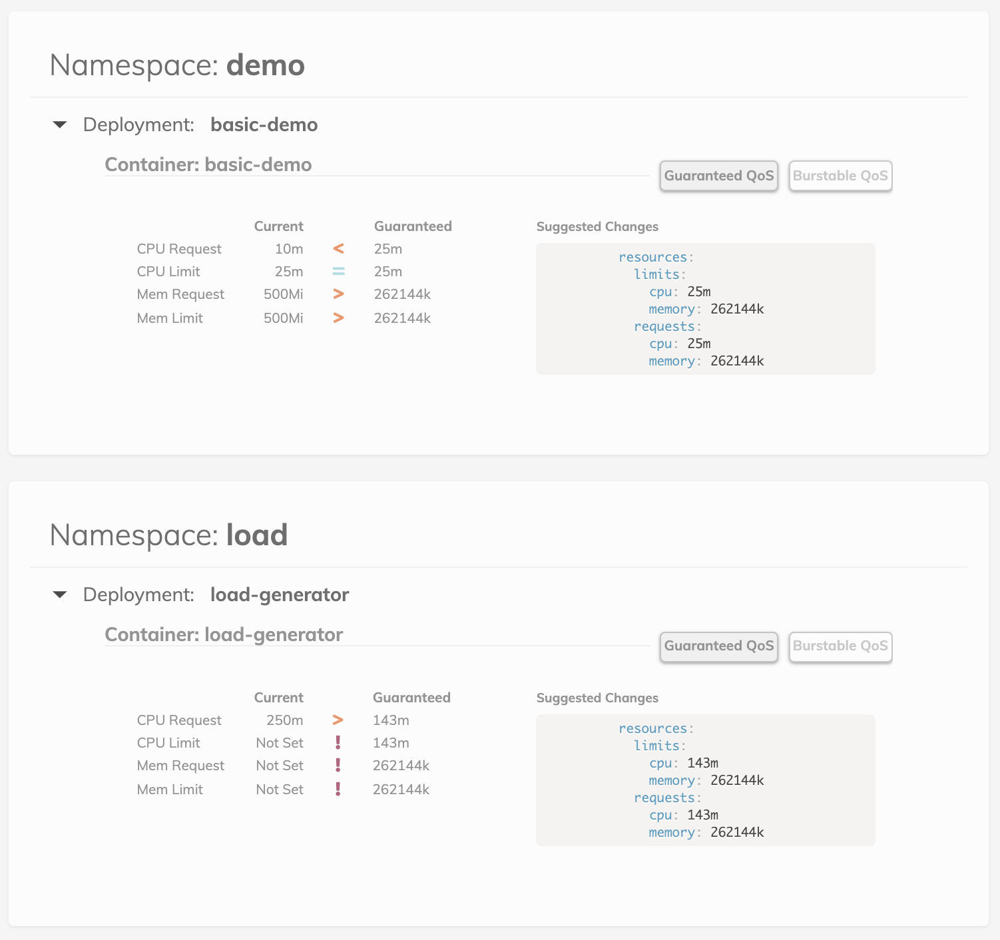

# Resource Monitoring using Goldilocks

Goldilocks monitors CPU and memory utlizations and recommends changes to the resources on the basis of VerticalPodAutoscaler and displays the suggestions about increasing or decreasing resources for optimized performance. In addition to that it can also autoscale vertically on the basis of these recommendations.

These suggestions are displayed via dashboard.

## Working

Goldilocks watches namespaces with the label `goldilocks.fairwinds.com/enabled: 'true'`. It watches all the deployments in those namespaces and deploys VerticalPodAutoScaler for all the deployments in those namespaces in recommendation mode. These recommendations are then displayed via the goldilocks dashboard.

In order to monitor your namespace via goldilocks, simply add the label `goldilocks.fairwinds.com/enabled:'true'` to your namespace and all the deployments in that namespace would be shown in the goldilocks dashboard.

## Autoscaling

VerticalPodAutoscalers VPAs deployments deployed by goldilocks run as an update mode of "off" by default, meaning the VPAs only report recommendations and do not actually auto-scale the Pods. In order to autoscale the pods on the basis of VPA recommendations, a label `goldilocks.fairwinds.com/vpa-update-mode: 'auto'` can be added to namespace and the deployments will scale up or scale down (change requests/limits not increase number of pods).

## Additional Flags

You can set the default behavior for VPA creation using some flags. When specified, labels will always take precedence over the command line flags. These flags can be passed in the controller deployment arguments.

- `--on-by-default` - create VPAs in all namespaces
- `--include-namespaces` - create VPAs in these namespaces, in addition to any that are labeled
- `--exclude-namespaces` - when `--on-by-default` is set, exclude this comma-separated list of namespaces

## Excluding containers

Containers can be excluded for individual deployments by applying a label to deployment. The label value should be a list of comma separated container names. The label value will be combined with any values provided through the `--exclude-containers` argument provided in the dashboard deployment. 

This option can be useful for hiding recommendations for sidecar containers for things like Linkerd and Istio.

In order to exclude containers from the `app deployment`, simply add the label with the comma separated names of the containers to exclude like this: `goldilocks.fairwinds.com/exclude-containers=linkerd-proxy,istio-proxy`

## Useful Links

- [Github Repo](https://github.com/FairwindsOps/goldilocks)